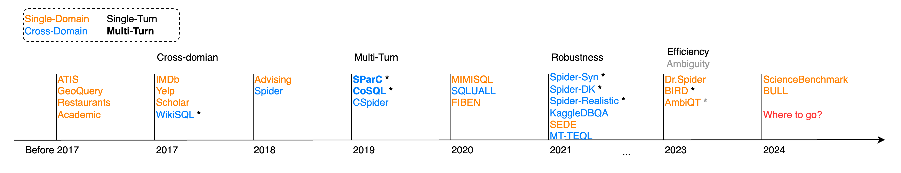
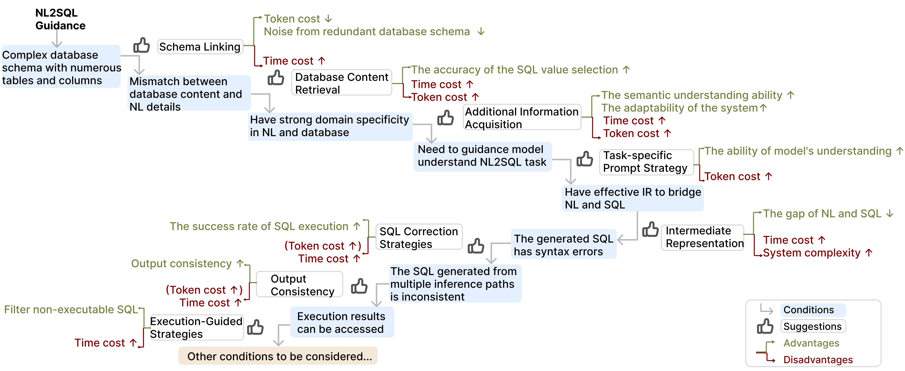

 <h1 align="center">NL2SQL Handbook</h1>
 
From this repository, you can view the latest advancements in NL2SQL. This handbook corresponds to our survey **"A Survey of NL2SQL with Large Language Models: Where are we, and where are we going?"**. We also provide tutorial slides to summarize the key points of this survey.
* [Paper Link](https://arxiv.org/abs/2408.05109)
* [Slides Link](./slides/) <font color=#808080>(to appear)</font>

If you are a novice, don't worry—we have prepared a practical guide for you, covering a wide range of foundational materials [here](#-practical-guide-for-novice).
## 🧭 NL2SQL Introduction 
Translating users' natural language queries (NL) into SQL queries can significantly reduce barriers to accessing relational databases and support various commercial applications. The performance of NL2SQL has been greatly improved with the emergence of language models (LMs). In this context, it is crucial to assess our current position, determine the NL2SQL solutions that should be adopted for specific scenarios by practitioners, and identify the research topics that researchers should explore next.

## 📈 NL2SQL Lifecycle

<p align="center">

</p>

+ Model: NL2SQL translation techniques that tackle not only NL ambiguity and under-specification, but also properly map NL with database schema and instances;

+ Data: From the collection of training data, data synthesis due to training data scarcity, to NL2SQL benchmarks;

+ Evaluation: Evaluating NL2SQL methods from multiple angles using different metrics and granularities;

+ Error Analysis: analyzing NL2SQL errors to find the root cause and guiding NL2SQL models to evolve.

## 🤔 Where Are We?
We categorize the challenges of NL2SQL into five levels and define each level's specific challenges. The first three levels focus on challenges that have been addressed or are still being tackled, affirming the progressive development of NL2SQL. The fourth level symbolizes the challenges we aim to resolve in the stage of LLMs. Finally, the fifth level represents our aspirations for the ultimate NL2SQL system. 

We describe the evolution of NL2SQL solutions from the perspective of language models, categorizing it into four stages.
For each stage of NL2SQL, we analyze the changes in target users and the extent to which challenges are addressed.
<p align="center">

</p>


## 🧩 Module-based NL2SQL Methods
We summarize the key modules of NL2SQL solutions
utilizing the language model. 
+ **Pre-processing** serves as an enhancement to the model’s inputs in the NL2SQL parsing process. You can get more details from this chapter: [Pre-Processing](chapter/Pre_Processing.md)
+ **NL2SQL translation methods** constitute the core of the NL2SQL solution, responsible for converting input natural language queries into SQL queries. You can get more details from this chapter: [NL2SQL Translation Methods](chapter/Translation_method.md)
+ **Post-processing** is a crucial step to refine the generated SQL queries, ensuring they meet user expectations more accurately. You can get more details from this chapter: [Post-Processing](chapter/Post_Processing.md)
<p align="center">

</p>

## 📰NL2SQL Paper List

1. The Dawn of Natural Language to SQL: Are We Fully Ready?
 [](https://arxiv.org/abs/2406.01265) [](https://github.com/HKUSTDial/NL2SQL360)
1. Text-to-SQL Empowered by Large Language Models: A Benchmark Evaluation. 
 [](https://arxiv.org/abs/2308.15363) [](https://github.com/BeachWang/DAIL-SQL) 
1. Interleaving Pre-Trained Language Models and Large Language
Models for Zero-Shot NL2SQL Generation. 
 [](https://arxiv.org/abs/2306.08891) [](https://github.com/ruc-datalab/ZeroNL2SQL)
1. CodeS: Towards Building Open-source Language Models for Text-to-SQL. 
 [](https://arxiv.org/abs/2402.16347) [](https://github.com/RUCKBReasoning/codes)
1. FinSQL: Model-Agnostic LLMs-based Text-to-SQL Framework for Financial Analysis. 
 [](https://arxiv.org/abs/2401.10506) [](https://github.com/bigbigwatermalon/FinSQL)
1. PURPLE: Making a Large Language Model a Better SQL Writer. 
 [](https://arxiv.org/abs/2403.20014) [](https://github.com/httdty/purple)
1. METASQL: A Generate-then-Rank Framework for Natural Language to SQL Translation. 
 [](https://arxiv.org/abs/2402.17144) [](https://github.com/Kaimary/MetaSQL)
1. The Death of Schema Linking? Text-to-SQL in the Age of Well-Reasoned Language Models.
 [](https://arxiv.org/pdf/2408.07702) 
1. DBCopilot: Scaling Natural Language Querying to Massive Databases.
 [](https://arxiv.org/abs/2312.03463) [](https://github.com/tshu-w/DBCopilot)
1. CHESS: Contextual Harnessing for Efficient SQL Synthesis.
 [](https://arxiv.org/abs/2405.16755) [](https://github.com/ShayanTalaei/CHESS)
1. PET-SQL: A Prompt-Enhanced Two-Round Refinement of Text-to-SQL with Cross-consistency.
 [](https://arxiv.org/abs/2403.09732) [](https://github.com/ruc-datalab/ZeroNL2SQL)
1. CoE-SQL: In-Context Learning for Multi-Turn Text-to-SQL with Chain-of-Editions.
 [](https://arxiv.org/abs/2405.02712) [](https://github.com/X-LANCE/text2sql-multiturn-GPT)
1. Few-shot Text-to-SQL Translation using Structure and Content Prompt Learning.
 [](https://dl.acm.org/doi/abs/10.1145/3589292) [](https://github.com/ruc-datalab/SC-prompt)
1. CatSQL: Towards Real World Natural Language to SQL Applications.
 [](https://www.vldb.org/pvldb/vol16/p1534-fu.pdf) [](https://github.com/asfuhan/CatSQL)
1. DIN-SQL: Decomposed In-Context Learning of Text-to-SQL with Self-Correction. 
 [](https://arxiv.org/abs/2304.11015) [](https://github.com/MohammadrezaPourreza/Few-shot-NL2SQL-with-prompting/tree/main)
1. ACT-SQL: In-Context Learning for Text-to-SQL with Automatically-Generated Chain-of-Thought.
 [](https://arxiv.org/abs/2310.17342) [](https://github.com/X-LANCE/text2sql-GPT)
1. Selective Demonstrations for Cross-domain Text-to-SQL.
 [](https://arxiv.org/abs/2310.06302) [](https://github.com/shuaichenchang/ODIS-Text-to-SQL)
1. RESDSQL: Decoupling Schema Linking and Skeleton Parsing for Text-to-SQL. 
 [](https://arxiv.org/abs/2302.05965) [](https://github.com/RUCKBReasoning/RESDSQL)
1. Graphix-T5: Mixing Pre-trained Transformers with Graph-Aware Layers for Text-to-SQL Parsing. 
 [](https://arxiv.org/abs/2301.07507) [](https://github.com/AlibabaResearch/DAMO-ConvAI/tree/main/graphix)
1. Improving Generalization in Language Model-based Text-to-SQL Semantic Parsing: Two Simple Semantic Boundary-based Techniques.
 [](https://virtual2023.aclweb.org/paper_P4350.html) [](https://github.com/Dakingrai/ood-generalization-semantic-boundary-techniques)
1. G<sup>3</sup>R: A Graph-Guided Generate-and-Rerank Framework for Complex and Cross-domain Text-to-SQL Generation.
 [](https://aclanthology.org/2023.findings-acl.23/) 
1. Importance of Synthesizing High-quality Data for Text-to-SQL Parsing.
 [](https://aclanthology.org/2023.findings-acl.86.pdf) 
1. C3: Zero-shot Text-to-SQL with ChatGPT 
 [](https://arxiv.org/abs/2307.07306) [](https://github.com/bigbigwatermalon/C3SQL)
1. MAC-SQL: A Multi-Agent Collaborative Framework for Text-to-SQL.
 [](https://arxiv.org/abs/2312.11242) [](https://github.com/wbbeyourself/MAC-SQL)
1. SQLformer: Deep Auto-Regressive Query Graph Generation for Text-to-SQL Translation.
 [](https://arxiv.org/abs/2310.18376) [](https://github.com/AdrianBZG/SQLformer)

## 📊 NL2SQL Benchmark
We create a timeline of the benchmark's development and mark relevant milestones. You can get more details from this chapter: [📊 Benchmark](chapter/Benchmark.md)
<p align="center">

</p>

## 🎯 Where Are We Going?

* 🎯Sovle Open NL2SQL Problem
* 🎯Develop Cost-effective NL2SQL Methods
* 🎯Make NL2SQL Solutions Trustworthy
* 🎯NL2SQL with Ambiguous and Unspecified NL Queries
* 🎯Adaptive Training Data Synthesis

## 📖 Catalog for Our Survey
You can get more information from our subsection. We introduce representative papers on related concepts:
* [Pre-Processing](chapter/Pre_Processing.md)
* [NL2SQL Translation Methods](chapter/Translation_method.md)
* [Post-Processing](chapter/Post_Processing.md)
* [Benchmark](chapter/Benchmark.md)
* [Evaluation](chapter/Evaluation.md)
* [Error Analysis](chapter/Error_Analysis.md)

## 💾 Practical Guide for Novice

### 📊 How to get data:
* We collect NL2SQL benchmark features and download links for you. You can get more details from this chapter: [Benchmark](chapter/Benchmark.md)
* The analysis code for benchmarks is available in the `src/dataset_analysis` directory. Benchmark analysis reports can be found in the `report/` directory.

### 🛠️ How to build an LLM-based NL2SQL model:

* Litgpt [Repository Link](https://github.com/Lightning-AI/litgpt)

    This repository offers access to over 20 high-performance large language models (LLMs) with comprehensive guides for pretraining, fine-tuning, and deploying at scale. It is designed to be beginner-friendly with from-scratch implementations and no complex abstractions.

* Fine-tuning and  In-Context learning for BIRD-SQL benchmark [Repository Link](https://github.com/AlibabaResearch/DAMO-ConvAI/tree/main/bird#fine-tuning-ft)
    
    A tutorial for both Fine-tuning and In-Context Learning is provided by the BIRD-SQL benchmark. 

### 🔎How to evaluate your model:

We collect NL2SQL evaluation metrics for you. You can get more details from this chapter: [Evaluation](chapter/Evaluation.md)

* NLSQL360 [Repository Link](https://github.com/HKUSTDial/NL2SQL360) 

     NL2SQL360 is a testbed for fine-grained evaluation of NL2SQL solutions. Our testbed integrates existing NL2SQL benchmarks, a repository of NL2SQL models, and various evaluation metrics, which aims to provide an intuitive and user-friendly platform to enable both standard and customized performance evaluations.    

* Test-suite-sql-eval [Repository Link](https://github.com/taoyds/test-suite-sql-eval)

    This repo contains a test suite evaluation metric for 11 text-to-SQL tasks. It is now the official metric of [Spider](https://yale-lily.github.io/spider), [SParC](https://yale-lily.github.io/sparc), and [CoSQL](https://yale-lily.github.io/cosql), and is also now available for Academic, ATIS, Advising, Geography, IMDB, Restaurants, Scholar, and Yelp (building on the amazing work by [Catherine and Jonathan](https://github.com/jkkummerfeld/text2sql-data)).   

* BIRD-SQL-Official [Repository Link](https://github.com/AlibabaResearch/DAMO-ConvAI/tree/main/bird#evaluation)

    It is now the official tool of [BIRD-SQL](https://bird-bench.github.io/). It is the first tool to propose VES and give an official test suite.  

### 🗺️ Roadmap and Decision Flow

You can get some inspiration from the Roadmap and Decision Flow.
<p align="center">

</p>

## 📌 Citation

```
@misc{liu2024surveynl2sqllargelanguage,
      title={A Survey of NL2SQL with Large Language Models: Where are we, and where are we going?}, 
      author={Xinyu Liu and Shuyu Shen and Boyan Li and Peixian Ma and Runzhi Jiang and Yuyu Luo and Yuxin Zhang and Ju Fan and Guoliang Li and Nan Tang},
      year={2024},
      eprint={2408.05109},
      archivePrefix={arXiv},
      primaryClass={cs.DB},
      url={https://arxiv.org/abs/2408.05109}, 
}
```
