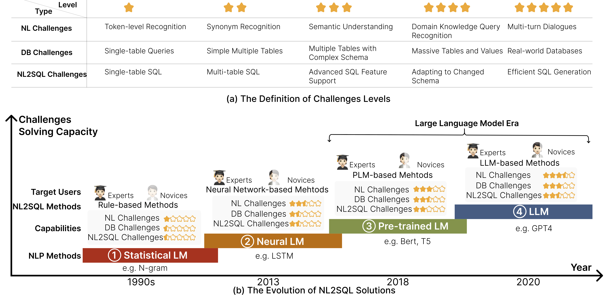
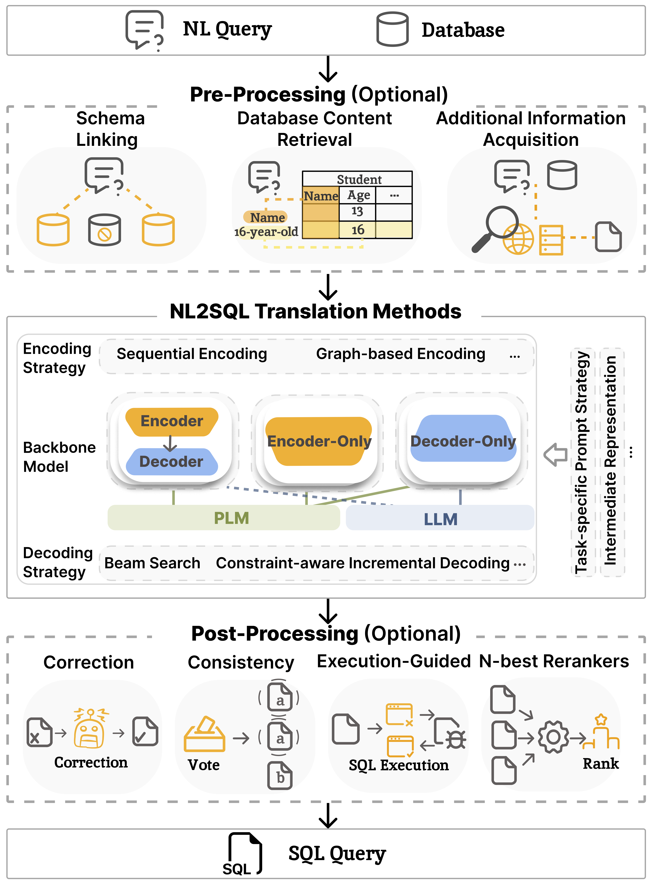

# <h1 align="center">NL2SQL Handbook</h1>

### <h3 align="center">Where are we, and where are we going?</h3>

## 🧭Introduction 
Translating users' natural language queries (NL) into sql queries can significantly reduce barriers to accessing relational databases and support various commercial applications. The performance of NL2SQL has been greatly improved with the emergence of language models (LMs). In this context, it is crucial to assess our current position, determine the NL2SQL solutions that should be adopted for specific scenarios by practitioners, and identify the research topics that researchers should explore next.

## 📈NL2SQL Lifecycle

+ Model: NL2SQL translation techniques that tackle not only NL ambiguity and under-specification, but also properly map NL with database schema and instances;

+ Data: From the collection of training data, data synthesis due to training data scarcity, to NL2SQL benchmarks;

+ Evaluation: Evaluating NL2SQL methods from multiple angles using different metrics and granularities;

+ Error Analysis: analyzing NL2SQL errors to find the root cause and guiding NL2SQL models to evolve.

## 🤔Where Are We
We categorize the challenges of NL2SQL into five levels and defined each level's specific challenges. The first three levels focus on challenges that have been addressed or are still being tackled, affirming the progressive development of NL2SQL. The fourth level symbolizes the challenges we aim to resolve in the stage of LLMs. Finally, the fifth level represents our aspirations for the ultimate NL2SQL system.

We describe the evolution of NL2SQL solutions from the perspective of language models, categorizing it into four stages.
For each stage of NL2SQL, we analyze the changes in target users and the extent to which challenges are addressed.

## 🧩Module-based NL2SQL Method
We summarize the key modules of NL2SQL solutions
utilizing language model. 
+ **Pre-processing** serves as a enhancement to model’s inputs in the NL2SQL parsing process.
+ **NL2SQL translation methods** constitute the core of the
NL2SQL solution, responsible for converting input natural
language queries into SQL queries.
+ **Post-processing** is a crucial step to refine the generated SQL queries, ensuring they meet user expectations more accurately.

## 🗺️Where Are We Going

* 🎯Sovle Open NL2SQL Problem
* 🎯Develop Cost-effective NL2SQL Methods
* 🎯Make NL2SQL Solutions Trustworthy
* 🎯NL2SQL with Ambiguous and Unspecified NL Queries
* 🎯Adaptive Training Data Synthesis

## 📰News for NL2SQL
💥Latest paper list:
* CodeS: Towards Building Open-source Language Models for Text-to-SQL. 
 
* FinSQL: Model-Agnostic LLMs-based Text-to-SQL Framework for Financial Analysis. 
 
* The Dawn of Natural Language to SQL: Are We Fully Ready?
 
* Text-to-SQL Empowered by Large Language Models: A Benchmark Evaluation. 
 
* Interleaving Pre-Trained Language Models and Large Language
Models for Zero-Shot NL2SQL Generation. 
 
* PURPLE: Making a Large Language Model a Better SQL Writer. 
 
* METASQL: A Generate-then-Rank Framework for Natural Language to SQL Translation. 
 
* DIN-SQL: Decomposed In-Context Learning of Text-to-SQL with Self-Correction. 
 
* ACT-SQL: In-Context Learning for Text-to-SQL with Automatically-Generated Chain-of-Thought
 
* RESDSQL: Decoupling Schema Linking and Skeleton Parsing for Text-to-SQL. 
 

## 📖Catalog for Survey
You can get more information from our subsection, we introduce representative papers on related concepts:
* [Pre-Processing](chapter/Pre_Processing.md)
* [NL2SQL translation methods](chapter/Translation_method.md)
* [Post-Processing](chapter/Post_Processing.md)
* [Benchamrk](chapter/Benchmark.md)
* [Evaluation](chapter/Evaluation.md)
* [Error Analysis](chapter/Error_Analysis.md)

## 💾Material for Novice
Practical Materialmation collected for Novice:

