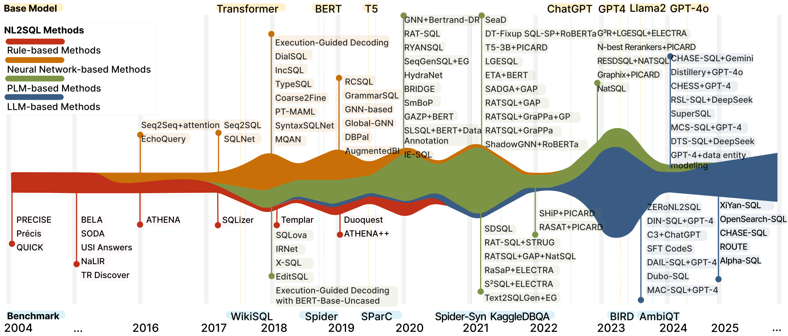

 <h1 align="center">Text-to-SQL Handbook</h1>

 <h3 align="center">NL2SQL Handbook</h3>
 
This is the official repository for **[TKDE'25] A Survey of Text-to-SQL in the Era of LLMs: Where are we, and where are we going?** and **[VLDB'24] The Dawn of Natural Language to SQL: Are We Fully Ready?**.
From this repository, you can explore the [latest advancements](#-text-to-sql-survey--tutorial) in Text-to-SQL research (a.k.a NL2SQL). We provide a comprehensive survey, in-depth research papers, and benchmark evaluations. 

** A Survey of Text-to-SQL in the Era of LLMs: Where are we, and where are we going?**
[](https://arxiv.org/abs/2408.05109)
[](./slides/NL2SQL_handbook.pdf)

** Natural Language to SQL: State of the Art and Open Problems**
[](https://dbgroup.cs.tsinghua.edu.cn/ligl/papers/VLDB25-NL2SQL.pdf)
[](./slides/NL2SQL-VLDB2025.pdf)

** The Dawn of Natural Language to SQL: Are We Fully Ready?**
[](https://www.vldb.org/pvldb/vol17/p3318-luo.pdf) 
[](./slides/NL2SQL360-VLDB2024.pdf)
[](https://github.com/HKUSTDial/NL2SQL360)

📧If we missed any interesting work, [connect with us](#connect-with-us).

<p align="center">

</p>

```bibtex
@article{liu2025survey,
  title={A Survey of Text-to-SQL in the Era of LLMs: Where are we, and where are we going?},
  author={Liu, Xinyu and Shen, Shuyu and Li, Boyan and Ma, Peixian and Jiang, Runzhi and Zhang, Yuxin and Fan, Ju and Li, Guoliang and Tang, Nan and Luo, Yuyu},
  journal={IEEE Transactions on Knowledge and Data Engineering},
  year={2025},
  publisher={IEEE}
}
```

## 🧭 Text-to-SQL Introduction 
Translating users' natural language queries (NL) into SQL queries can significantly reduce barriers to accessing relational databases and support various commercial applications. The performance of Text-to-SQL has been greatly improved with the emergence of language models (LMs). In this context, it is crucial to assess our current position, determine the Text-to-SQL solutions that should be adopted for specific scenarios by practitioners, and identify the research topics that researchers should explore next.

<p align="center">

</p>

## 📈 Text-to-SQL Lifecycle

<p align="center">

</p>

+ Model: Text-to-SQL translation techniques that tackle not only NL ambiguity and under-specification, but also properly map NL with database schema and instances;

+ Data: From the collection of training data, data synthesis due to training data scarcity, to Text-to-SQL benchmarks;

+ Evaluation: Evaluating Text-to-SQL methods from multiple angles using different metrics and granularities;

+ Error Analysis: analyzing Text-to-SQL errors to find the root cause and guiding Text-to-SQL models to evolve.

## 🤔 Where Are We?
We categorize the challenges of Text-to-SQL into five levels, each addressing specific hurdles. The first three levels cover challenges that have been or are currently being addressed, reflecting the progressive development of Text-to-SQL. The fourth level represents the challenges we aim to tackle in the LLMs stage, while the fifth level outlines our vision for Text-to-SQL system in the next five years. 

We describe the evolution of Text-to-SQL solutions from the perspective of language models, categorizing it into four stages.
For each stage of Text-to-SQL, we analyze the changes in target users and the extent to which challenges are addressed.
<p align="center">

</p>


## 🧩 Module-based Text-to-SQL Methods
We summarize the key modules of Text-to-SQL solutions
utilizing the language model. 
+ **Pre-processing** serves as an enhancement to the model’s inputs in the Text-to-SQL parsing process. You can get more details from this chapter: [Pre-Processing](chapter/Pre_Processing.md)
+ **Text-to-SQL translation methods** constitute the core of the Text-to-SQL solution, responsible for converting input natural language queries into SQL queries. You can get more details from this chapter: [Text-to-SQL Translation Methods](chapter/Translation_method.md)
+ **Post-processing** is a crucial step to refine the generated SQL queries, ensuring they meet user expectations more accurately. You can get more details from this chapter: [Post-Processing](chapter/Post_Processing.md)
<p align="center">

</p>

## 📚 Text-to-SQL Survey & Tutorial

1. A Survey of Text-to-SQL in the Era of LLMs:
Where are we, and where are we going?
 [](https://arxiv.org/abs/2408.05109) [](https://github.com/HKUSTDial/NL2SQL_Handbook)
1. Natural Language to SQL: State of the Art and Open Problems.  [](https://dbgroup.cs.tsinghua.edu.cn/ligl/papers/VLDB25-NL2SQL.pdf)
1. Next-generation database interfaces: A survey of LLM-based Text-to-SQL. [](https://arxiv.org/abs/2406.08426)
1. A Survey on Employing Large Language Models for Text-to-SQL Tasks.
 [](https://arxiv.org/pdf/2407.15186)
1. Large Language Model Enhanced Text-to-SQL Generation: A Survey.
 [](https://arxiv.org/abs/2410.06011)
1. From Natural Language to SQL: Review of LLM-based Text-to-SQL Systems.
 [](https://arxiv.org/pdf/2410.01066)
1. Natural language interfaces for tabular data querying and visualization: A survey.
 [](https://arxiv.org/abs/2310.17894)
1. Natural Language Interfaces for Databases with Deep Learning. [](https://dl.acm.org/doi/10.14778/3611540.3611575)
1. A survey on deep learning approaches for text-to-SQL.
 [](https://dl.acm.org/doi/10.1007/s00778-022-00776-8)
1. Recent Advances in Text-to-SQL: A Survey of What We Have and What We Expect.
 [](https://aclanthology.org/2022.coling-1.190/)
1. A Deep Dive into Deep Learning Approaches for Text-to-SQL Systems.
 [](https://dl.acm.org/doi/10.1145/3448016.3457543)
1. State of the Art and Open Challenges in Natural Language Interfaces to Data.
 [](https://dl.acm.org/doi/10.1145/3318464.3383128)
1. Natural language to SQL: Where are we today?  [](https://www.vldb.org/pvldb/vol13/p1737-kim.pdf)

## 📰 Text-to-SQL Paper List
1. Alpha-SQL: Zero-Shot Text-to-SQL using Monte Carlo Tree Search
 [](https://arxiv.org/abs/2502.17248) [](https://alpha-sql-hkust.github.io/)
1. NL2SQL-BUGs: A Benchmark for Detecting Semantic Errors in NL2SQL Translation. [](https://arxiv.org/pdf/2503.11984) [](https://nl2sql-bugs.github.io/)
1. EllieSQL: Cost-Efficient Text-to-SQL with Complexity-Aware Routing.  [](https://arxiv.org/abs/2503.22402) [](https://elliesql.github.io/)
1. Structure-Guided Large Language Models for Text-to-SQL Generation.  [](https://icml.cc/virtual/2025/poster/44477)
1. Sphinteract: Resolving Ambiguities in NL2SQL Through User Interaction.
 [](https://www.vldb.org/pvldb/vol18/p1145-zhao.pdf) [](https://github.com/ZhaoFuheng/Sphinteract)
1. OmniSQL: Synthesizing High-quality Text-to-SQL Data at Scale.  []([https://www.vldb.org/pvldb/vol18/p1145-zhao.pdf](https://arxiv.org/abs/2503.02240)) [](https://github.com/RUCKBReasoning/OmniSQL)
1. EVOSCHEMA: TOWARDS TEXT-TO-SQL ROBUSTNESS AGAINST SCHEMA EVOLUTION.  [](https://openreview.net/pdf?id=NfUHBaZdLw) [](https://github.com/zhangtianshu/EvoSchema)
1. Is Long Context All You Need? Leveraging LLM's Extended Context for NL2SQL.  [](https://arxiv.org/abs/2501.12372) [](https://github.com/yeounoh/lc_nl2sql)
1. The Power of Constraints in Natural Language to SQL Translation.  [](https://www.vldb.org/pvldb/vol18/p2097-ren.pdf)
[](https://github.com/httdty/REDSQL_VLDB)
1. OpenSearch-SQL: Enhancing Text-to-SQL with Dynamic Few-shot and Consistency Alignment.  [](https://arxiv.org/pdf/2502.14913) [](https://github.com/OpenSearch-AI/OpenSearch-SQL)
1. Reliable Text-to-SQL with Adaptive Abstention. [](https://arxiv.org/abs/2501.10858) 
1. SNAILS: Schema Naming Assessments for Improved LLM-Based SQL Inference. [](https://dl.acm.org/doi/10.1145/3709727)
1. Automated Validating and Fixing of Text-to-SQL Translation with Execution Consistency.  [](https://ipads.se.sjtu.edu.cn/zh/publications/SQLDriller.pdf)
1. Grounding Natural Language to SQL Translation with Data-Based Self-Explanations. [](https://arxiv.org/abs/2411.02948) [](https://github.com/Kaimary/CycleSQL)
1. AID-SQL: Adaptive In-Context Learning of Text-to-SQL with Difficulty-Aware Instruction and Retrieval-Augmented Generation.  [](https://www.computer.org/csdl/proceedings-article/icde/2025/360300d945/26FZCc99mg0) 
1. CLEAR: A Parser-Independent Disambiguation Framework for NL2SQL.
 [](https://www.computer.org/csdl/proceedings-article/icde/2025/360300d302/26FZBD2hBJe) 
1. CHASE-SQL: Multi-Path Reasoning and Preference Optimized Candidate Selection in Text-to-SQL.
 [](https://arxiv.org/pdf/2410.01943v1) 
1. Spider 2.0: Evaluating Language Models on Real-World Enterprise Text-to-SQL Workflows.
 [](https://arxiv.org/abs/2411.07763) [](https://github.com/xlang-ai/Spider2)
1. ROUTE: Robust Multitask Tuning and Collaboration for Text-to-SQL.  [](https://arxiv.org/pdf/2412.10138)
1. SHARE: An SLM-based Hierarchical Action CorREction Assistant for Text-to-SQL. [](https://arxiv.org/abs/2506.00391)
1. DCG-SQL: Enhancing In-Context Learning for Text-to-SQL with Deep Contextual Schema Link Graph.  [](https://arxiv.org/abs/2505.19956)
1. Uncovering the Impact of Chain-of-Thought Reasoning for Direct Preference Optimization: Lessons from Text-to-SQL. [](https://arxiv.org/abs/2502.11656)
1. STaR-SQL: Self-Taught Reasoner for Text-to-SQL.  [](https://arxiv.org/abs/2502.13550)
1. SQLGenie: A Practical LLM based System for Reliable and Efficient SQL Generation  []([https://arxiv.org/abs/2502.13550](https://aclanthology.org/2025.acl-industry.71/))
1. Confidence Estimation for Error Detection in Text-to-SQL Systems.  [](https://arxiv.org/abs/2501.09527)
1. SQLord: A Robust Enterprise Text-to-SQL Solution via Reverse Data Generation and Workflow Decomposition.  [](https://dl.acm.org/doi/pdf/10.1145/3701716.3715541)
1. DBCopilot: Scaling Natural Language Querying to Massive Databases. [](https://arxiv.org/abs/2312.03463) [](https://github.com/tshu-w/DBCopilot)
1. Utilising Large Language Models for Adversarial Attacks in Text-to-SQL: A Perpetrator and Victim Approach.
 [](https://arxiv.org/pdf/2502.20657) [](https://github.com/XGenerationLab/XiYan-DBDescGen)
1. You Only Read Once (YORO): Learning to Internalize Database Knowledge for Text-to-SQL.
 [](https://arxiv.org/abs/2409.12172) [](https://sig4kg.github.io/archer-bench/)
1. Boosting Text-to-SQL through Multi-grained Error Identification.
 [](https://aclanthology.org/2025.coling-main.289.pdf)
1. Gen-SQL: Efficient Text-to-SQL By Bridging Natural Language Question And Database Schema With Pseudo-Schema.
 [](https://aclanthology.org/2025.coling-main.256/)
1. MAC-SQL: A Multi-Agent Collaborative Framework for Text-to-SQL.
 [](https://arxiv.org/abs/2312.11242) [](https://github.com/wbbeyourself/MAC-SQL)
1. PARSQL: Enhancing Text-to-SQL through SQL Parsing and Reasoning.  [](https://aclanthology.org/2024.findings-acl.120/)
1. UCS-SQL: Uniting Content and Structure for Enhanced Semantic Bridging In Text-to-SQL.  [](https://openreview.net/forum?id=xnTouV7wyr)
1. SQLForge: Synthesizing Reliable and Diverse Data to Enhance Text-to-SQL Reasoning in LLMs.  [](https://arxiv.org/abs/2505.13725)
1. Optimizing Reasoning for Text-to-SQL with Execution Feedback.  [](https://arxiv.org/abs/2503.19988)
1. Knowledge Base Construction for Knowledge-Augmented Text-to-SQL.  [](https://arxiv.org/pdf/2505.22096)
1. SQLong: Enhanced NL2SQL for Longer Contexts with LLMs.
 [](https://arxiv.org/pdf/2502.16747)
1. Reasoning-SQL: Reinforcement Learning with SQL Tailored Partial Rewards for Reasoning-Enhanced Text-to-SQL.  [](https://arxiv.org/pdf/2503.23157)
1. Automatic Metadata Extraction for Text-to-SQL.  [](https://arxiv.org/abs/2505.19988) 
1. CSC-SQL: Corrective Self-Consistency in Text-to-SQL via Reinforcement Learning.  [](https://arxiv.org/abs/2505.13271) [](https://github.com/CycloneBoy/csc_sql/)
1. Cheaper, Better, Faster, Stronger: Robust Text-to-SQL without Chain-of-Thought or Fine-Tuning.  [](https://arxiv.org/pdf/2505.14174) [](https://github.com/genaasia/N-rep)
1. Reward-SQL: Boosting Text-to-SQL via Stepwise Reasoning and Process-Supervised Rewards.  [](https://arxiv.org/pdf/2505.04671) [](https://github.com/ruc-datalab/RewardSQL)
1. SQL-R1: Training Natural Language to SQL Reasoning Model By Reinforcement Learning.  [](https://arxiv.org/pdf/2504.08600) 
1. Arctic-Text2SQL-R1: Simple Rewards, Strong Reasoning in Text-to-SQL.  [](https://arxiv.org/abs/2505.20315) [](https://github.com/snowflakedb/ArcticTraining)
1. Corrective Self-Consistency in Text-to-SQL via Reinforcement Learning.  [](https://arxiv.org/abs/2505.13271) [](https://github.com/CycloneBoy/csc_sql)
1. SQLForge: Synthesizing Reliable and Diverse Data to Enhance
Text-to-SQL Reasoning in LLMs.
 [](https://arxiv.org/pdf/2505.13725)
1. Think2SQL: Reinforce LLM Reasoning Capabilities for Text2SQL.  [](https://arxiv.org/pdf/2504.15077)
1. Distill-C: Enhanced NL2SQL via Distilled Customization with LLMs.  [](https://arxiv.org/pdf/2504.00048)
1. OmniSQL: Synthesizing High-quality Text-to-SQL Data at Scale.  [](https://arxiv.org/pdf/2503.02240) [](https://github.com/RUCKBReasoning/OmniSQL)
1. SQL-Factory: A Multi-Agent Framework for High-Quality and Large-Scale SQL Generation.  [](https://arxiv.org/pdf/2504.14837)
1. Text2SQL is Not Enough: Unifying AI and Databases with TAG.  [](https://arxiv.org/pdf/2408.14717) [](https://github.com/TAG-Research/TAG-Bench) 
1. Automatic database description generation for Text-to-SQL.
 [](https://arxiv.org/pdf/2502.20657)
[](https://github.com/XGenerationLab/XiYan-DBDescGen)
1. MCTS-SQL: An Effective Framework for Text-to-SQL with Monte Carlo Tree Search.
 [](https://arxiv.org/abs/2501.16607)
1. SQL-o1: A Self-Reward Heuristic Dynamic Search Method for Text-to-SQL.  [](https://arxiv.org/pdf/2502.11741)
1. FEATHER-SQL: A Lightweight NL2SQL Framework with Dual-Model Collaboration Paradigm for Small Language Models.
 [](https://arxiv.org/pdf/2503.17811)
1. FI-NL2PY2SQL: Financial Industry NL2SQL Innovation Model Based on Python and Large Language Model.
 [](https://www.mdpi.com/1999-5903/17/1/12)
1. FGCSQL: A Three-Stage Pipeline for Large Language Model-Driven Chinese Text-to-SQL.
 [](https://www.mdpi.com/2079-9292/14/6/1214)
1. Transforming Medical Data Access: The Role and Challenges of Recent Language Models in SQL Query Automation.  [](https://www.mdpi.com/1999-4893/18/3/124)
1. The Dawn of Natural Language to SQL: Are We Fully Ready?
 [](https://arxiv.org/abs/2406.01265) [](https://github.com/HKUSTDial/NL2SQL360)
1. Text-to-SQL Empowered by Large Language Models: A Benchmark Evaluation. 
 [](https://arxiv.org/abs/2308.15363) [](https://github.com/BeachWang/DAIL-SQL) 
1. Interleaving Pre-Trained Language Models and Large Language Models for Zero-Shot NL2SQL Generation. 
 [](https://arxiv.org/abs/2306.08891) [](https://github.com/ruc-datalab/ZeroNL2SQL)
1. Generating Succinct Descriptions of Database Schemata for Cost-Efficient Prompting of Large Language Models. 
 [](https://dl.acm.org/doi/abs/10.14778/3681954.3682017) [](https://github.com/itrummer/schemacompression)
1. ScienceBenchmark: A Complex Real-World Benchmark for Evaluating Natural Language to SQL Systems. [](https://arxiv.org/abs/2306.04743) [](https://sciencebenchmark.cloudlab.zhaw.ch/)
1. CodeS: Towards Building Open-source Language Models for Text-to-SQL. 
 [](https://arxiv.org/abs/2402.16347) [](https://github.com/RUCKBReasoning/codes)
1. FinSQL: Model-Agnostic LLMs-based Text-to-SQL Framework for Financial Analysis. 
 [](https://arxiv.org/abs/2401.10506) [](https://github.com/bigbigwatermalon/FinSQL)
1. PURPLE: Making a Large Language Model a Better SQL Writer. 
 [](https://arxiv.org/abs/2403.20014) [](https://github.com/httdty/purple)
1. METASQL: A Generate-then-Rank Framework for Natural Language to SQL Translation. 
 [](https://arxiv.org/abs/2402.17144) [](https://github.com/Kaimary/MetaSQL)
1. Archer: A Human-Labeled Text-to-SQL Dataset with Arithmetic, Commonsense and Hypothetical Reasoning.
 [](https://aclanthology.org/2024.eacl-long.6/) [](https://sig4kg.github.io/archer-bench/)
1. Synthesizing Text-to-SQL Data from Weak and Strong LLMs.
 [](https://arxiv.org/pdf/2408.03256) [](https://github.com/Yangjiaxi/Sense)
1. Understanding the Effects of Noise in Text-to-SQL: An Examination of the BIRD-Bench Benchmark.
 [](https://arxiv.org/pdf/2402.12243) [](https://github.com/niklaswretblad/the-effects-of-noise-in-text-to-SQL)
1. I Need Help! Evaluating LLM’s Ability to Ask for Users’ Support: A Case Study on Text-to-SQL Generation.
 [](https://arxiv.org/pdf/2407.14767) [](https://github.com/appier-research/i-need-help)
1. PTD-SQL: Partitioning and Targeted Drilling with LLMs in Text-to-SQL.
 [](https://arxiv.org/pdf/2409.14082) [](https://github.com/lrlbbzl/PTD-SQL)
1. Improving Retrieval-augmented Text-to-SQL with AST-based Ranking and Schema Pruning.
 [](https://arxiv.org/pdf/2407.03227)
1. Data-Centric Text-to-SQL with Large Language Models. 
 [](https://openreview.net/pdf?id=gDKIjZcg93)
1. Research and Practice on Database Interaction Based on Natural Language Processing
 [](https://arxiv.org/abs/2310.17894)
1. XiYan-SQL: A Multi-Generator Ensemble Framework for Text-to-SQL.
 [](https://arxiv.org/pdf/2411.08599)
1. Structure Guided Large Language Model for SQL Generation. 
 [](https://arxiv.org/pdf/2402.13284) 
1. A Plug-and-Play Natural Language Rewriter for Natural Language to SQL.
 [](https://arxiv.org/pdf/2412.17068) 
1. RSL-SQL: Robust Schema Linking in Text-to-SQL Generation.   
 [](https://arxiv.org/abs/2403.15879) [](https://github.com/glee4810/TrustSQL)
1. In-Context Reinforcement Learning based Retrieval-Augmented Generation for Text-to-SQL.
 [](https://assets.amazon.science/09/f4/493c574346f895bbb0303282a501/in-context-reinforcement-learning-based-retrieval-augmented-generation-for-text-to-sql.pdf) 
1. TrustSQL: Benchmarking Text-to-SQL Reliability with Penalty-Based Scoring.
 [](https://arxiv.org/pdf/2411.00073) [](https://github.com/Laqcce-cao/RSL-SQL)
1. LAIA-SQL: Enhancing Natural Language to SQL Generation in Multi-Table QA via Task Decomposition and Keyword Extraction
 [](https://openreview.net/pdf?id=WYdpjwKQma)
1. Research on Large Model Text-to-SQL Optimization Method for Intelligent Interaction in the Field of Construction Safety.
 [](https://ieeexplore.ieee.org/abstract/document/10810146)
1. SQLh-GEN: Bridging the Dialect Gap for Text-to-SQL Via Synthetic Data And Model Merging. [](https://arxiv.org/pdf/2408.12733v2)
1. Grounding Natural Language to SQL Translation with Data-Based Self-Explanations.
 [](https://arxiv.org/pdf/2411.02948) [](https://github.com/Kaimary/CycleSQL)
1. Towards Optimizing SQL Generation via LLM Routing.
 [](https://arxiv.org/abs/2411.04319)
1. E-SQL: Direct Schema Linking via Question Enrichment in Text-to-SQL.
 [](https://arxiv.org/abs/2409.16751) [](https://github.com/HasanAlpCaferoglu/E-SQL)
1. DB-GPT: Empowering Database Interactions with Private Large Language Models.
 [](https://arxiv.org/abs/2312.17449) [](https://github.com/eosphoros-ai/DB-GPT)
1. The Death of Schema Linking? Text-to-SQL in the Age of Well-Reasoned Language Models.
 [](https://arxiv.org/pdf/2408.07702)  
1. CHESS: Contextual Harnessing for Efficient SQL Synthesis.
 [](https://arxiv.org/abs/2405.16755) [](https://github.com/ShayanTalaei/CHESS)
1. PET-SQL: A Prompt-Enhanced Two-Round Refinement of Text-to-SQL with Cross-consistency.
 [](https://arxiv.org/abs/2403.09732) [](https://github.com/ruc-datalab/ZeroNL2SQL)
1. CoE-SQL: In-Context Learning for Multi-Turn Text-to-SQL with Chain-of-Editions.
 [](https://arxiv.org/abs/2405.02712) [](https://github.com/X-LANCE/text2sql-multiturn-GPT)
1. AMBROSIA: A Benchmark for Parsing Ambiguous Questions into Database Queries.
 [](https://arxiv.org/abs/2406.19073) [](https://ambrosia-benchmark.github.io/)
1. Text-to-SQL Calibration: No Need to Ask—Just Rescale Model Probabilities.
 [](https://arxiv.org/pdf/2411.16742) 
1. Few-shot Text-to-SQL Translation using Structure and Content Prompt Learning.
 [](https://dl.acm.org/doi/abs/10.1145/3589292) [](https://github.com/ruc-datalab/SC-prompt)
1. CatSQL: Towards Real World Natural Language to SQL Applications.
 [](https://www.vldb.org/pvldb/vol16/p1534-fu.pdf) [](https://github.com/asfuhan/CatSQL)
1. DIN-SQL: Decomposed In-Context Learning of Text-to-SQL with Self-Correction. 
 [](https://arxiv.org/abs/2304.11015) [](https://github.com/MohammadrezaPourreza/Few-shot-NL2SQL-with-prompting/tree/main)
1. Data Ambiguity Strikes Back: How Documentation Improves GPT's Text-to-SQL. 
 [](https://openreview.net/pdf?id=FflKTuIRTD) 
1. ACT-SQL: In-Context Learning for Text-to-SQL with Automatically-Generated Chain-of-Thought.
 [](https://arxiv.org/abs/2310.17342) [](https://github.com/X-LANCE/text2sql-GPT)
1. Selective Demonstrations for Cross-domain Text-to-SQL.
 [](https://arxiv.org/abs/2310.06302) [](https://github.com/shuaichenchang/ODIS-Text-to-SQL)
1. RESDSQL: Decoupling Schema Linking and Skeleton Parsing for Text-to-SQL. 
 [](https://arxiv.org/abs/2302.05965) [](https://github.com/RUCKBReasoning/RESDSQL)
1. Graphix-T5: Mixing Pre-trained Transformers with Graph-Aware Layers for Text-to-SQL Parsing. 
 [](https://arxiv.org/abs/2301.07507) [](https://github.com/AlibabaResearch/DAMO-ConvAI/tree/main/graphix)
1. Improving Generalization in Language Model-based Text-to-SQL Semantic Parsing: Two Simple Semantic Boundary-based Techniques.
 [](https://virtual2023.aclweb.org/paper_P4350.html) [](https://github.com/Dakingrai/ood-generalization-semantic-boundary-techniques)
1. G<sup>3</sup>R: A Graph-Guided Generate-and-Rerank Framework for Complex and Cross-domain Text-to-SQL Generation.
 [](https://aclanthology.org/2023.findings-acl.23/) 
1. Importance of Synthesizing High-quality Data for Text-to-SQL Parsing.
 [](https://aclanthology.org/2023.findings-acl.86.pdf) 
1. Know What I don’t Know: Handling Ambiguous and Unknown Questions for Text-to-SQL.
 [](https://aclanthology.org/2023.findings-acl.352/) [](https://github.com/wbbeyourself/DTE)
1. C3: Zero-shot Text-to-SQL with ChatGPT 
 [](https://arxiv.org/abs/2307.07306) [](https://github.com/bigbigwatermalon/C3SQL)
1. SQLformer: Deep Auto-Regressive Query Graph Generation for Text-to-SQL Translation.
 [](https://arxiv.org/abs/2310.18376) [](https://github.com/AdrianBZG/SQLformer)


## 📊 Text-to-SQL Benchmark
We create a timeline of the benchmark's development and mark relevant milestones. You can get more details from this chapter: [📊 Benchmark](chapter/Benchmark.md)
<p align="center">

</p>

## 🎯 Where Are We Going?

* 🎯Solve Open Text-to-SQL Problem
* 🎯Develop Cost-effective Text-to-SQL Methods
* 🎯Make Text-to-SQL Solutions Trustworthy
* 🎯Text-to-SQL with Ambiguous and Unspecified NL Queries
* 🎯Adaptive Training Data Synthesis

## 📖 Catalog for Our Survey
You can get more information from our subsection. We introduce representative papers on related concepts:
* [Pre-Processing](chapter/Pre_Processing.md)
* [Text-to-SQL Translation Methods](chapter/Translation_method.md)
* [Post-Processing](chapter/Post_Processing.md)
* [Benchmark](chapter/Benchmark.md)
* [Evaluation](chapter/Evaluation.md)
* [Error Analysis](chapter/Error_Analysis.md)

## 💾 Practical Guide for Novice

### 📊 How to get data:
* We collect Text-to-SQL benchmark features and download links for you. You can get more details from this chapter: [Benchmark](chapter/Benchmark.md)
* The analysis code for benchmarks is available in the `src/dataset_analysis` directory. Benchmark analysis reports can be found in the `report/` directory.

### 🛠️ How to build an LLM-based Text-to-SQL model:

* Litgpt [Repository Link](https://github.com/Lightning-AI/litgpt)

    This repository offers access to over 20 high-performance large language models (LLMs) with comprehensive guides for pretraining, fine-tuning, and deploying at scale. It is designed to be beginner-friendly with from-scratch implementations and no complex abstractions.

* LLaMA-Factory [Repository Link](https://github.com/hiyouga/LLaMA-Factory)
    Unified Efficient Fine-Tuning of 100+ LLMs. Integrating various models with scalable training resources, advanced algorithms, practical tricks, and comprehensive experiment monitoring tools, this setup enables efficient and faster inference through optimized APIs and UIs.

* Fine-tuning and In-Context learning for BIRD-SQL benchmark [Repository Link](https://github.com/AlibabaResearch/DAMO-ConvAI/tree/main/bird#fine-tuning-ft)
    
    A tutorial for both Fine-tuning and In-Context Learning is provided by the BIRD-SQL benchmark. 

### 🔎How to evaluate your model:

We collect NL2SQL evaluation metrics for you. You can get more details from this chapter: [Evaluation](chapter/Evaluation.md)

* NLSQL360 [Repository Link](https://github.com/HKUSTDial/NL2SQL360) 

     NL2SQL360 is a testbed for fine-grained evaluation of NL2SQL solutions. Our testbed integrates existing NL2SQL benchmarks, a repository of NL2SQL models, and various evaluation metrics, which aims to provide an intuitive and user-friendly platform to enable both standard and customized performance evaluations.    

* Test-suite-sql-eval [Repository Link](https://github.com/taoyds/test-suite-sql-eval)

    This repo contains a test suite evaluation metric for 11 text-to-SQL tasks. It is now the official metric of [Spider](https://yale-lily.github.io/spider), [SParC](https://yale-lily.github.io/sparc), and [CoSQL](https://yale-lily.github.io/cosql), and is also now available for Academic, ATIS, Advising, Geography, IMDB, Restaurants, Scholar, and Yelp (building on the amazing work by [Catherine and Jonathan](https://github.com/jkkummerfeld/text2sql-data)).   

* BIRD-SQL-Official [Repository Link](https://github.com/AlibabaResearch/DAMO-ConvAI/tree/main/bird#evaluation)

    It is now the official tool of [BIRD-SQL](https://bird-bench.github.io/). It is the first tool to propose VES and give an official test suite.  


### 🗺️ Roadmap and Decision Flow

You can get some inspiration from the Roadmap and Decision Flow.
<p align="center">

</p>

## 📱 Text-to-SQL Related Applications:

* Chat2DB: AI-driven database tool and SQL client, The hottest GUI client, supporting MySQL, Oracle, PostgreSQL, DB2, SQL Server, DB2, SQLite, H2, ClickHouse, and more. [](https://github.com/codePhiliaX/Chat2DB) [](https://chat2db-ai.com/zh-CN)
* DB-GPT: AI Native Data App Development framework with AWEL(Agentic Workflow Expression Language) and Agents. [](https://github.com/eosphoros-ai/DB-GPT) 
* Postgres.new: In-browser Postgres sandbox with AI assistance.  [](https://github.com/supabase-community/postgres-new/tree/main) [](https://postgres.new/)
* QueryGPT – Natural Language to SQL Using Generative AI. [[](https://www.uber.com/en-JP/blog/query-gpt/)

## 📮Connect with Us
Please feel free to contact us if we missed any interesting work.

📧 xliu371[at]connect.hkust-gz.edu.cn

